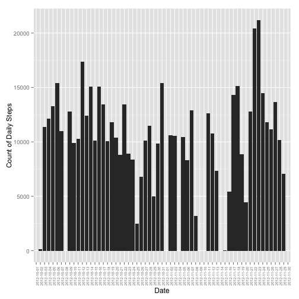
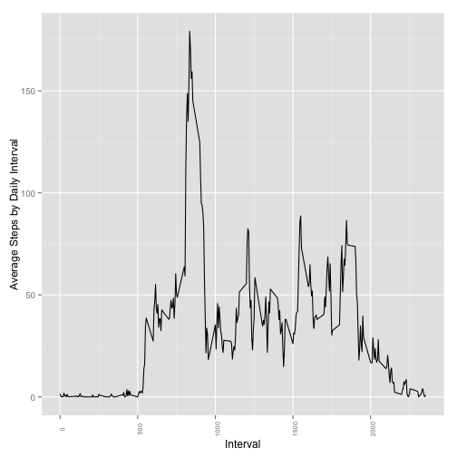
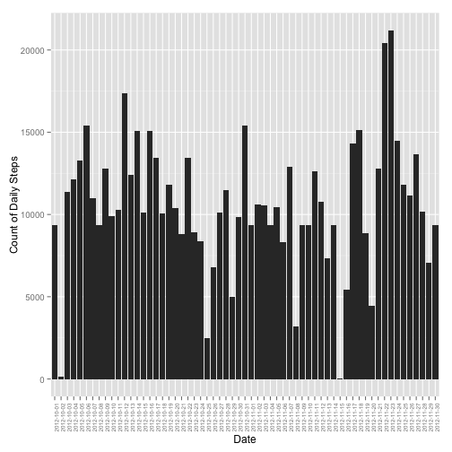
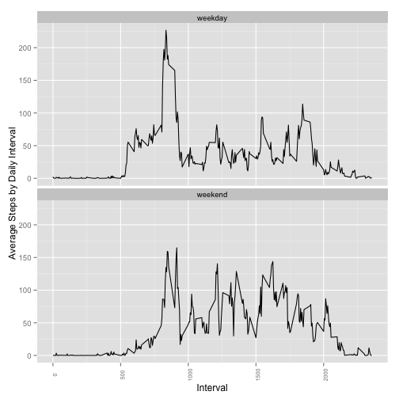

#Reproducible Research Project1


```r
#Set the working directory and load necessary libararies
setwd("/Volumes/DiskStation1/jhufton/MyDownload/Coursera/DataScientistsToolbox/ReproducableResearch/CourseProject1/RepData_PeerAssessment1")
library(plyr)
library(ggplot2)
library(lubridate)

#Read in the data set, set NA values to 0
activity.raw <- read.csv("./activity.csv", header=TRUE)
activity <- activity.raw
activity[is.na(activity)] <- 0
```

##Histogram of Steps Taken by Day
Below is a histogram showing the number of steps taken for each day in the 
dataset.  

Note that there are eight days in the dataset for which there is no
step data.  For these days, the missing values in the original data were
substitued with the value 0.  These eight days can be identified as days for 
which there is no value shown in the histogram below.

```r
#Aggregate the steps for each interval in a day to a daily number of total 
#steps for each day
daily.steps <- ddply(activity, .(date), summarize, daily_steps = 
                         sum(steps, na.rm = TRUE))
#Plot the total 
ggplot(daily.steps, aes(x=date, y=daily_steps)) + geom_bar(stat="identity") + 
    theme(axis.text.x = element_text(angle = 90, size = rel(0.65))) + 
    ylab("Count of Daily Steps") + xlab("Date")
```

 

##Calculation of Mean and Median Daily Steps

###Mean Daily Steps
The mean number of steps per interval across each day, for all days in the dataset,
is computed and the results (in tabular format) are shown below.

Note that the eight days with missing data have a mean number of steps of 0.


```r
mean.steps <- ddply(activity, .(date), summarize, daily_steps = 
                        mean(steps, na.rm = TRUE))
mean.steps[is.na(mean.steps)] <- 0
names(mean.steps) <- c("Date", "MeanSteps")
mean.steps
```

```
##          Date  MeanSteps
## 1  2012-10-01  0.0000000
## 2  2012-10-02  0.4375000
## 3  2012-10-03 39.4166667
## 4  2012-10-04 42.0694444
## 5  2012-10-05 46.1597222
## 6  2012-10-06 53.5416667
## 7  2012-10-07 38.2465278
## 8  2012-10-08  0.0000000
## 9  2012-10-09 44.4826389
## 10 2012-10-10 34.3750000
## 11 2012-10-11 35.7777778
## 12 2012-10-12 60.3541667
## 13 2012-10-13 43.1458333
## 14 2012-10-14 52.4236111
## 15 2012-10-15 35.2048611
## 16 2012-10-16 52.3750000
## 17 2012-10-17 46.7083333
## 18 2012-10-18 34.9166667
## 19 2012-10-19 41.0729167
## 20 2012-10-20 36.0937500
## 21 2012-10-21 30.6284722
## 22 2012-10-22 46.7361111
## 23 2012-10-23 30.9652778
## 24 2012-10-24 29.0104167
## 25 2012-10-25  8.6527778
## 26 2012-10-26 23.5347222
## 27 2012-10-27 35.1354167
## 28 2012-10-28 39.7847222
## 29 2012-10-29 17.4236111
## 30 2012-10-30 34.0937500
## 31 2012-10-31 53.5208333
## 32 2012-11-01  0.0000000
## 33 2012-11-02 36.8055556
## 34 2012-11-03 36.7048611
## 35 2012-11-04  0.0000000
## 36 2012-11-05 36.2465278
## 37 2012-11-06 28.9375000
## 38 2012-11-07 44.7326389
## 39 2012-11-08 11.1770833
## 40 2012-11-09  0.0000000
## 41 2012-11-10  0.0000000
## 42 2012-11-11 43.7777778
## 43 2012-11-12 37.3784722
## 44 2012-11-13 25.4722222
## 45 2012-11-14  0.0000000
## 46 2012-11-15  0.1423611
## 47 2012-11-16 18.8923611
## 48 2012-11-17 49.7881944
## 49 2012-11-18 52.4652778
## 50 2012-11-19 30.6979167
## 51 2012-11-20 15.5277778
## 52 2012-11-21 44.3993056
## 53 2012-11-22 70.9270833
## 54 2012-11-23 73.5902778
## 55 2012-11-24 50.2708333
## 56 2012-11-25 41.0902778
## 57 2012-11-26 38.7569444
## 58 2012-11-27 47.3819444
## 59 2012-11-28 35.3576389
## 60 2012-11-29 24.4687500
## 61 2012-11-30  0.0000000
```

###Median Daily Steps
The median number of steps per interval across each day, for all days 
in the data set, is computed and the results (in tabular format) are shown below 
(this is a per day calculation).  

Note that since the number of steps for most individual intervals in the is zero, 
the median number of steps calculated across the intervals for each day is also 0.

```r
median.steps <- ddply(activity, .(date), summarize, daily_steps = 
                          median(steps, na.rm = TRUE))
median.steps[is.na(median.steps)] <- 0
names(median.steps) <- c("Date", "MedianSteps")
median.steps
```

```
##          Date MedianSteps
## 1  2012-10-01           0
## 2  2012-10-02           0
## 3  2012-10-03           0
## 4  2012-10-04           0
## 5  2012-10-05           0
## 6  2012-10-06           0
## 7  2012-10-07           0
## 8  2012-10-08           0
## 9  2012-10-09           0
## 10 2012-10-10           0
## 11 2012-10-11           0
## 12 2012-10-12           0
## 13 2012-10-13           0
## 14 2012-10-14           0
## 15 2012-10-15           0
## 16 2012-10-16           0
## 17 2012-10-17           0
## 18 2012-10-18           0
## 19 2012-10-19           0
## 20 2012-10-20           0
## 21 2012-10-21           0
## 22 2012-10-22           0
## 23 2012-10-23           0
## 24 2012-10-24           0
## 25 2012-10-25           0
## 26 2012-10-26           0
## 27 2012-10-27           0
## 28 2012-10-28           0
## 29 2012-10-29           0
## 30 2012-10-30           0
## 31 2012-10-31           0
## 32 2012-11-01           0
## 33 2012-11-02           0
## 34 2012-11-03           0
## 35 2012-11-04           0
## 36 2012-11-05           0
## 37 2012-11-06           0
## 38 2012-11-07           0
## 39 2012-11-08           0
## 40 2012-11-09           0
## 41 2012-11-10           0
## 42 2012-11-11           0
## 43 2012-11-12           0
## 44 2012-11-13           0
## 45 2012-11-14           0
## 46 2012-11-15           0
## 47 2012-11-16           0
## 48 2012-11-17           0
## 49 2012-11-18           0
## 50 2012-11-19           0
## 51 2012-11-20           0
## 52 2012-11-21           0
## 53 2012-11-22           0
## 54 2012-11-23           0
## 55 2012-11-24           0
## 56 2012-11-25           0
## 57 2012-11-26           0
## 58 2012-11-27           0
## 59 2012-11-28           0
## 60 2012-11-29           0
## 61 2012-11-30           0
```

###Average Daily Activity Patterm
Below is a graph showing the average number of steps for each interval of the day 
(computed as an average number of steps across corresponding intervals for all
days in the data set).


```r
average.interval.steps <- ddply(activity, .(interval), summarize, 
                                avg_steps = mean(steps, na.rm = TRUE))
ggplot(average.interval.steps, aes(x=interval, y=avg_steps)) + 
    geom_line(stat="identity") + 
    theme(axis.text.x = element_text(angle = 90, size = rel(0.75))) + 
    ylab("Average Steps by Daily Interval") + xlab("Interval")
```

 

The maximum average number of steps per interval and the daily interval where 
the maximum occurs is:


```r
average.interval.steps[average.interval.steps$avg_steps == 
                           max(average.interval.steps$avg_steps),]
```

```
##     interval avg_steps
## 104      835  179.1311
```

Since the interval column counts in 5 minute increments, and the value 100 
corresponds to 60 minutes, the interval 835 corresponds to 8 hours and 35 
minutes into the day, or 8:35AM.

###Imputing Missing Values

####Number of Missing Values in the Raw Dataset
The number of intervals with NA values for the number of steps is:

```r
nrow(activity.raw[is.na(activity.raw$steps), ])
```

```
## [1] 2304
```
From observation of the numbers of steps per day in the first graph (Histogram 
of Steps Taken by Day), we can see that these missing values correspond to the 8 
full days of missing step values in the dataset.  

Inspection of the data for the mean number of daily steps shows these days as 
having 0 average steps.  That the missing values are for 8 full days of data 
can also be confirmed by inspecting the raw data file as well.

Days with NA values for step data are:

    *   2012-10-01
    *   2012-10-08
    *   2012-11-01
    *   2012-11-04
    *   2012-11-09
    *   2012-11-10
    *   2012-11-14
    *   2012-11-30

Since we have calculated an average number of steps by interval using all the 
available daily data in the dataset, we can impute (i.e. replace) the missing 
daily data with that calculated daily average data and recompute the mean and 
median figures for each day by interval.


```r
#Replace the missing step data for the days that have no data in the original
#dataset
dates <- c("2012-10-01", "2012-10-08", "2012-11-01", "2012-11-04", "2012-11-09", 
           "2012-11-10", "2012-11-14", "2012-11-30")
for (d in dates) { 
    activity[activity$date == d, 1] <- average.interval.steps[ ,2]
}
```
###Histogram of Steps Taken by Day Using Imputed Data
Below is a histogram showing the number of steps taken for each day in the 
dataset, now using the imputed data added in the preceding step.  


```r
#Aggregate the steps for each interval in a day to a daily number of total 
#steps for each day
daily.steps <- ddply(activity, .(date), summarize, daily_steps = 
                         sum(steps, na.rm = TRUE))
#Plot the total 
ggplot(daily.steps, aes(x=date, y=daily_steps)) + geom_bar(stat="identity") + 
    theme(axis.text.x = element_text(angle = 90, size = rel(0.65))) + 
    ylab("Count of Daily Steps") + xlab("Date")
```

 

We now re-calculate the mean and median steps for each day in the dataset, this
time including the imputed data for the eight days missing data in the original
dataset.

###Mean Daily Steps with Imputed Missing Values
Using the modified data set with imputed missing values we compute the mean 
number of steps per interval across each day for all days in the data set
(this is a per day calculation).

```r
mean.steps <- ddply(activity, .(date), summarize, daily_steps = 
                        mean(steps, na.rm = TRUE))
mean.steps[is.na(mean.steps)] <- 0
names(mean.steps) <- c("Date", "MeanSteps")
mean.steps
```

```
##          Date  MeanSteps
## 1  2012-10-01 32.4799636
## 2  2012-10-02  0.4375000
## 3  2012-10-03 39.4166667
## 4  2012-10-04 42.0694444
## 5  2012-10-05 46.1597222
## 6  2012-10-06 53.5416667
## 7  2012-10-07 38.2465278
## 8  2012-10-08 32.4799636
## 9  2012-10-09 44.4826389
## 10 2012-10-10 34.3750000
## 11 2012-10-11 35.7777778
## 12 2012-10-12 60.3541667
## 13 2012-10-13 43.1458333
## 14 2012-10-14 52.4236111
## 15 2012-10-15 35.2048611
## 16 2012-10-16 52.3750000
## 17 2012-10-17 46.7083333
## 18 2012-10-18 34.9166667
## 19 2012-10-19 41.0729167
## 20 2012-10-20 36.0937500
## 21 2012-10-21 30.6284722
## 22 2012-10-22 46.7361111
## 23 2012-10-23 30.9652778
## 24 2012-10-24 29.0104167
## 25 2012-10-25  8.6527778
## 26 2012-10-26 23.5347222
## 27 2012-10-27 35.1354167
## 28 2012-10-28 39.7847222
## 29 2012-10-29 17.4236111
## 30 2012-10-30 34.0937500
## 31 2012-10-31 53.5208333
## 32 2012-11-01 32.4799636
## 33 2012-11-02 36.8055556
## 34 2012-11-03 36.7048611
## 35 2012-11-04 32.4799636
## 36 2012-11-05 36.2465278
## 37 2012-11-06 28.9375000
## 38 2012-11-07 44.7326389
## 39 2012-11-08 11.1770833
## 40 2012-11-09 32.4799636
## 41 2012-11-10 32.4799636
## 42 2012-11-11 43.7777778
## 43 2012-11-12 37.3784722
## 44 2012-11-13 25.4722222
## 45 2012-11-14 32.4799636
## 46 2012-11-15  0.1423611
## 47 2012-11-16 18.8923611
## 48 2012-11-17 49.7881944
## 49 2012-11-18 52.4652778
## 50 2012-11-19 30.6979167
## 51 2012-11-20 15.5277778
## 52 2012-11-21 44.3993056
## 53 2012-11-22 70.9270833
## 54 2012-11-23 73.5902778
## 55 2012-11-24 50.2708333
## 56 2012-11-25 41.0902778
## 57 2012-11-26 38.7569444
## 58 2012-11-27 47.3819444
## 59 2012-11-28 35.3576389
## 60 2012-11-29 24.4687500
## 61 2012-11-30 32.4799636
```

###Median Daily Steps with Imputed Missing Values
Using the modified data set with imputed missing values we compute the median 
number of steps per interval across each day for all days in the data set (this 
is a per day calculation).  Note that since the number of steps for most 
individual intervals in the is zero, the median number of steps calculated 
across the intervals for most days is also 0.  But, for those days for which
the average daily data was used, the calculation shows a median number of steps
of 29.63934.

```r
#Create a data frame with the median daily steps from the activity data
#with the imputed data replacing missing data in the oringal dataset
median.steps <- ddply(activity, .(date), summarize, daily_steps = 
                          median(steps, na.rm = TRUE))
median.steps[is.na(median.steps)] <- 0
names(median.steps) <- c("Date", "MedianSteps")
median.steps
```

```
##          Date MedianSteps
## 1  2012-10-01    29.63934
## 2  2012-10-02     0.00000
## 3  2012-10-03     0.00000
## 4  2012-10-04     0.00000
## 5  2012-10-05     0.00000
## 6  2012-10-06     0.00000
## 7  2012-10-07     0.00000
## 8  2012-10-08    29.63934
## 9  2012-10-09     0.00000
## 10 2012-10-10     0.00000
## 11 2012-10-11     0.00000
## 12 2012-10-12     0.00000
## 13 2012-10-13     0.00000
## 14 2012-10-14     0.00000
## 15 2012-10-15     0.00000
## 16 2012-10-16     0.00000
## 17 2012-10-17     0.00000
## 18 2012-10-18     0.00000
## 19 2012-10-19     0.00000
## 20 2012-10-20     0.00000
## 21 2012-10-21     0.00000
## 22 2012-10-22     0.00000
## 23 2012-10-23     0.00000
## 24 2012-10-24     0.00000
## 25 2012-10-25     0.00000
## 26 2012-10-26     0.00000
## 27 2012-10-27     0.00000
## 28 2012-10-28     0.00000
## 29 2012-10-29     0.00000
## 30 2012-10-30     0.00000
## 31 2012-10-31     0.00000
## 32 2012-11-01    29.63934
## 33 2012-11-02     0.00000
## 34 2012-11-03     0.00000
## 35 2012-11-04    29.63934
## 36 2012-11-05     0.00000
## 37 2012-11-06     0.00000
## 38 2012-11-07     0.00000
## 39 2012-11-08     0.00000
## 40 2012-11-09    29.63934
## 41 2012-11-10    29.63934
## 42 2012-11-11     0.00000
## 43 2012-11-12     0.00000
## 44 2012-11-13     0.00000
## 45 2012-11-14    29.63934
## 46 2012-11-15     0.00000
## 47 2012-11-16     0.00000
## 48 2012-11-17     0.00000
## 49 2012-11-18     0.00000
## 50 2012-11-19     0.00000
## 51 2012-11-20     0.00000
## 52 2012-11-21     0.00000
## 53 2012-11-22     0.00000
## 54 2012-11-23     0.00000
## 55 2012-11-24     0.00000
## 56 2012-11-25     0.00000
## 57 2012-11-26     0.00000
## 58 2012-11-27     0.00000
## 59 2012-11-28     0.00000
## 60 2012-11-29     0.00000
## 61 2012-11-30    29.63934
```

###Weekday vs. Weekend Comparison
The next set of graphs shows a comparison of the average number of steps by 
daily interval between weekdays and weekend days.

The weekday figure closely resembles the first graph (Histogram of Steps Taken 
by Day) for the full daily average which encompassed both weekend days and 
weekdays, while the weekend figure shows activity spread more evenly through 
out the day.  

```r
#Add a new column showing whether the date is a weekday or weekend day
activity$DoW <- 
    with(activity, ifelse(weekdays(as.POSIXct(date)) == "Monday", "weekday",
                   ifelse(weekdays(as.POSIXct(date)) == "Tuesday", "weekday",
                   ifelse(weekdays(as.POSIXct(date)) == "Wednesday", "weekday",
                   ifelse(weekdays(as.POSIXct(date)) == "Thursday", "weekday",
                   ifelse(weekdays(as.POSIXct(date)) == "Friday", "weekday",
                   ifelse(weekdays(as.POSIXct(date)) == "Saturday", "weekend", 
                   "weekend")))))) )

#Convert the DoW column to a factor
activity$DoW <- as.factor(activity$DoW)

#Recalculate the average daily interval steps data frame using the modified 
#activity information
average.interval.steps <- ddply(activity, .(interval, DoW), summarize, 
                                avg_steps = mean(steps, na.rm = TRUE))

#Create a two panel plot showing average steps per daily interval for 
#weekdays and weekend days
ggplot(average.interval.steps, aes(x=interval, y=avg_steps)) + 
    geom_line(stat="identity") + 
    theme(axis.text.x = element_text(angle = 90, size = rel(0.75))) + 
    ylab("Average Steps by Daily Interval") + xlab("Interval") + 
    facet_wrap(~DoW, ncol=1)
```

 

