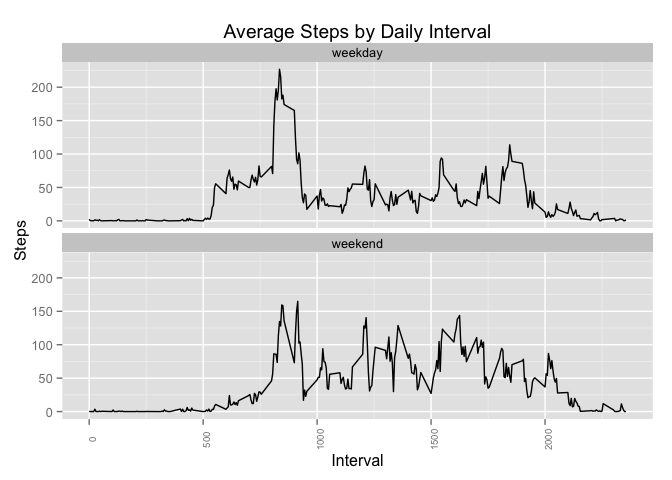

# Project1

#Reproducible Research Project1


```r
#Set the working directory and load necessary libararies
setwd("/Volumes/DiskStation1/jhufton/MyDownload/Coursera/DataScientistsToolbox/ReproducableResearch/CourseProject1/RepData_PeerAssessment1")
library(plyr)
library(ggplot2)
library(lubridate)
```

```
## 
## Attaching package: 'lubridate'
## 
## The following object is masked from 'package:plyr':
## 
##     here
```

```r
library(xtable)

#Read in the data set, set NA values to 0
activity.raw <- read.csv("./activity.csv", header=TRUE)
activity <- activity.raw
activity[is.na(activity)] <- 0
```

##Histogram of Steps Taken by Day
Below is a histogram based on the total number of steps taken for each day in the 
dataset.  


```r
#Aggregate the steps for each interval in a day to a daily number of total 
#steps for each day
daily.steps <- ddply(activity, .(date), summarize, daily_steps = 
                         sum(steps, na.rm = TRUE))
                         
max_daily_steps <- as.integer(max(daily.steps$daily_steps))

#Plot a histogram of daily steps
hist(daily.steps$daily_steps, breaks=25, main="Histogram of Total Daily Steps", 
     xlab="Total Daily Steps", ylab="Days(Frequency)")
```

 

Note that there are eight days in the dataset for which there is no
step data, and two days with near zero number of steps.  This results in a large 
number of days for which there is a 0 or near 0 number of steps.  In this data 
set the maximum sum of daily steps is 21194, which 
agrees with the frequency counts (e.g.Days) at 20,000 steps or more in the histogram.

##Calculation of Mean and Median Daily Steps

###Mean Daily Steps


```r
mean_daily_steps <- as.integer(mean(daily.steps$daily_steps))
#NOTE: This value appears in-line in the text below using the 
#`r mean_daily_steps` syntax
```
Using the sum of daily steps data calculated in the previous section, we find the
mean number of daily steps is 9354.

###Median Daily Steps


```r
median_daily_steps <- as.integer(median(daily.steps$daily_steps))
#NOTE: This value appears in-line in the text below using the 
#`r median_daily_steps` syntax
```
Using the sum of daily steps data calculated in the previous section, we find the
median number of daily steps is 10395.

###Average Daily Activity Patterm
Below is a graph showing the average number of steps for each interval of the day 
(computed as an average number of steps across corresponding intervals for all
days in the data set).


```r
average.interval.steps <- ddply(activity, .(interval), summarize, 
                                avg_steps = mean(steps, na.rm = TRUE))
ggplot(average.interval.steps, aes(x=interval, y=avg_steps)) + 
    geom_line(stat="identity") + 
    theme(axis.text.x = element_text(angle = 90, size = rel(0.75))) + 
    ylab("Steps") + xlab("Interval") +
    ggtitle("Average Steps by Daily Interval")
```

 

####Maximum Average Number of Steps in an Interval
The maximum average number of steps per interval and the daily interval where 
the maximum occurs is:


```r
average.interval.steps[average.interval.steps$avg_steps == 
                           max(average.interval.steps$avg_steps),]
```

```
##     interval avg_steps
## 104      835  179.1311
```

Since the interval column counts in 5 minute increments, and the value 100 
corresponds to 60 minutes, the interval 835 corresponds to 8 hours and 35 
minutes into the day, or 8:35AM.

###Imputing Missing Values

####Number of Missing Values in the Raw Dataset


```r
missing_values <- nrow(activity.raw[is.na(activity.raw$steps), ])
#NOTE: This value appears in-line in the text below using the 
#`r missing_values` syntax
```

The number of intervals in the orginal data set with missing values is 
2304.

From observation of the numbers of steps per day in the first graph (Histogram 
of Steps Taken by Day), we can see that these missing values correspond to the 8 
full days of missing step values in the dataset.  

Inspection of the data for the mean number of daily steps shows these days as 
having 0 average steps.  That the missing values are for 8 full days of data 
can also be confirmed by inspecting the raw data file as well.

Days with NA values for step data are:

    *   2012-10-01
    *   2012-10-08
    *   2012-11-01
    *   2012-11-04
    *   2012-11-09
    *   2012-11-10
    *   2012-11-14
    *   2012-11-30

Since we have calculated an average number of steps by interval using all the 
available daily data in the dataset, we can impute (i.e. replace) the missing 
daily data with that calculated daily average data and recompute the mean and 
median figures for each day by interval.


```r
#Replace the missing step data for the days that have no data in the original
#dataset
dates <- c("2012-10-01", "2012-10-08", "2012-11-01", "2012-11-04", "2012-11-09", 
           "2012-11-10", "2012-11-14", "2012-11-30")
for (d in dates) { 
    activity[activity$date == d, 1] <- average.interval.steps[ ,2]
}
```
###Histogram of Steps Taken by Day Using Imputed Data
Below is a histogram based on the total number of steps taken for each day in the 
dataset, now using the imputed data added in the preceding step.  


```r
#Aggregate the steps for each interval in a day to a daily number of total 
#steps for each day
daily.steps <- ddply(activity, .(date), summarize, daily_steps = 
                         sum(steps, na.rm = TRUE))
max_imputed_daily_steps <- as.integer(max(daily.steps$daily_steps))
#NOTE: This value appears in-line in the text below using the 
#`r max_imputed_daily_steps` syntax

#Plot the total 
hist(daily.steps$daily_steps, breaks=25, main="Histogram of Total Daily Steps", 
     xlab="Total Daily Steps", ylab="Days(Frequency)")
```

 

Note that the main differences between this histogram and the original one shown
at the begining of this document are the frequence counts of days with 0 or near 
0 steps (reduced by the 8 days for which the imputed values were substitued for the original
0 step counts) and the frequency count of days to the left of the 10,000 count
level at the center of the histogram.  That frequency count (for the later change) 
was increased by the 8 days for which the imputed values were used.

Note that there remain two days with near zero number of steps.  This results in 
two days for which there is a near 0 number of steps appearing the histogram 
above.  In this data set the maximum sum of daily steps is 21194, 
which agrees with the frequency counts (e.g. Days) at 20,000 steps or more in 
the histogram.

We now re-calculate the mean and median steps for each day in the dataset, this
time including the imputed data for the eight days missing data in the original
dataset.

###Mean Daily Steps with Imputed Missing Values


```r
mean_imputed_daily_steps <- as.integer(mean(daily.steps$daily_steps))
#NOTE: This value appears in-line in the text below using the 
#`r mean_imputed_daily_steps` syntax
```
Using the sum of daily steps data calculated in the previous section which now
includes the imputed data substitued for the days originally without data, we 
find the mean number of daily steps is 10581.

This compares to a mean number of daily steps of 9354 before 
the imputed data was used to replace the missing data in the original data set.

###Median Daily Steps with Imputed Missing Values


```r
#Create a data frame with the median daily steps from the activity data
#with the imputed data replacing missing data in the oringal dataset
median_imputed_daily_steps <- as.integer(median(daily.steps$daily_steps))
#NOTE: This value appears in-line in the text below using the 
#`r median_imputed_daily_steps` syntax
```
Using the sum of daily steps data calculated in the previous section which now
includes the imputed data substitued for the days originally without data, we 
find the median number of daily steps is 10395.

This compares to a median number of daily steps of 10395 
before the imputed data was used to replace the missing data in the original data set.

###Weekday vs. Weekend Comparison
The next set of graphs shows a comparison of the average number of steps by 
daily interval between weekdays and weekend days.


```r
#Add a new column showing whether the date is a weekday or weekend day
activity$dow <- 
    with(activity, ifelse(weekdays(as.POSIXct(date)) == "Monday", "weekday",
                   ifelse(weekdays(as.POSIXct(date)) == "Tuesday", "weekday",
                   ifelse(weekdays(as.POSIXct(date)) == "Wednesday", "weekday",
                   ifelse(weekdays(as.POSIXct(date)) == "Thursday", "weekday",
                   ifelse(weekdays(as.POSIXct(date)) == "Friday", "weekday",
                   ifelse(weekdays(as.POSIXct(date)) == "Saturday", "weekend", 
                   "weekend")))))) )

#Convert the DoW column to a factor
activity$dow <- as.factor(activity$dow)

#Recalculate the average daily interval steps data frame using the modified 
#activity information
average.interval.steps <- ddply(activity, .(interval, dow), summarize, 
                                avg_steps = mean(steps, na.rm = TRUE))

#Create a two panel plot showing average steps per daily interval for 
#weekdays and weekend days
ggplot(average.interval.steps, aes(x=interval, y=avg_steps)) + 
    geom_line(stat="identity") + 
    theme(axis.text.x = element_text(angle = 90, size = rel(0.75))) + 
    ylab("Steps") + xlab("Interval") + 
    ggtitle("Average Steps by Daily Interval") +
    facet_wrap(~dow, ncol=1)
```

 

The weekday figure above closely resembles the first graph (Histogram of Steps Taken 
by Day) for the full daily average which encompassed both weekend days and 
weekdays. The weekend (only) figure immediately above shows activity spread more 
evenly through out the day which might be explained by less sedintary work-related 
time during the weekend.  

